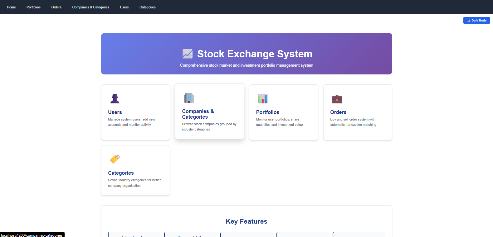
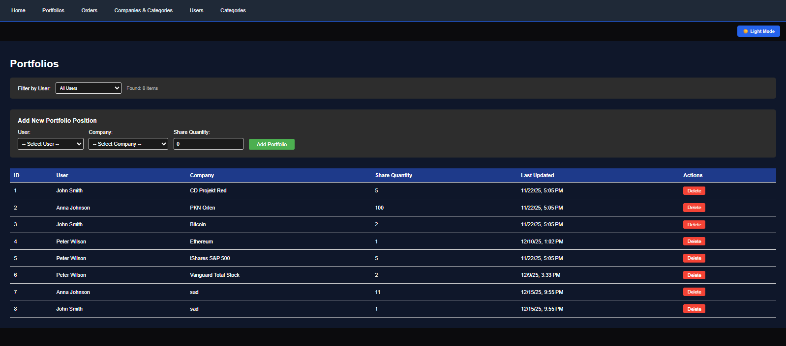
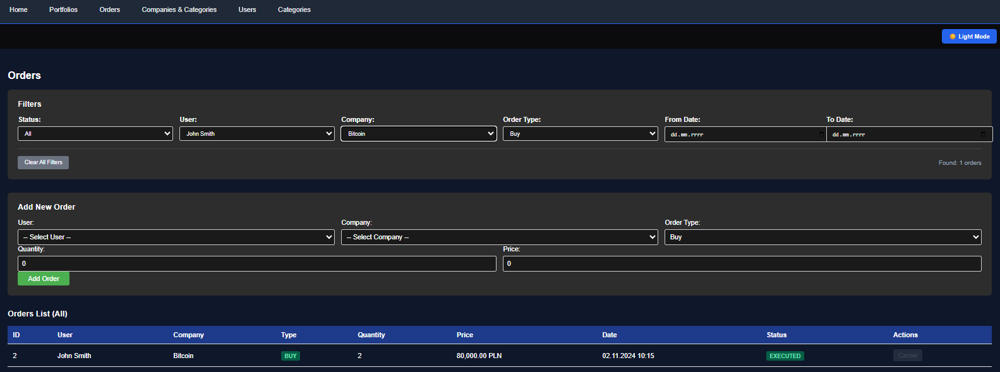
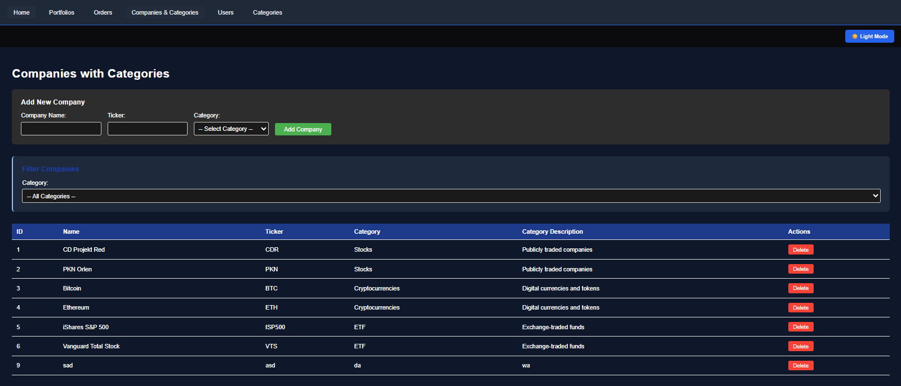
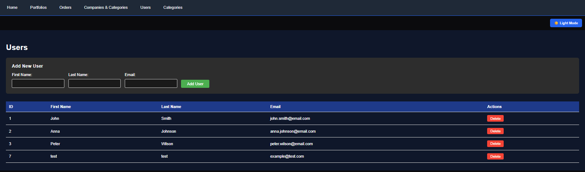
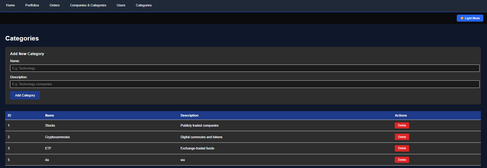

# 📈 Stock Exchange System

A comprehensive stock market and investment portfolio management system built with **Spring Boot** and **Angular**.

## 🚀 Features

- **User Management** - Create and manage user accounts with full CRUD operations
- **Companies & Categories** - Browse stock companies grouped by industry categories
- **Portfolio Management** - Monitor user portfolios, share quantities and investment values
- **Order System** - Buy and sell orders with automatic transaction matching
- **Category System** - Define industry categories for better company organization
- **Real-time Trading** - Automatic order matching based on price and time priority
- **Share Validation** - Prevents selling more shares than available (portfolio - pending sells)
- **Dark/Light Mode** - Toggle between dark and light themes
## 🖼️ Screenshots

## 🖼️ Screenshots

### 1. Home Page (Light Mode)

*Dashboard showing feature cards, statistics, and welcome section in light theme*

### 2. Home Page (Dark Mode)

*Dashboard interface with dark theme enabled, featuring white text on dark backgrounds*

### 3. Portfolio Management

*Portfolio management interface displaying user holdings with filtering options*

### 4. Order Management

*Order management system showing buy/sell orders with status tracking*

### 5. Companies Listing

*Company listing page with filtering by stock categories*

### 6. User Management

*User administration panel with create, read, update, delete operations*

### 7. Category Management

*Category management interface for organizing stock companies*
## 🛠️ Technology Stack

### Backend
- **Java 17** with Spring Boot 4.0.0
- **Spring Data JPA** for database operations
- **SQL Server** as the database
- **REST API** architecture
- **Gradle** for dependency management

### Frontend
- **Angular 19** (Standalone Components)
- **TypeScript**
- **RxJS** for reactive programming
- **CSS3** with dark/light mode support
- **RouterLink** for navigation

## 📋 Prerequisites

- **Java 17** or higher
- **Node.js 18+** and npm
- **SQL Server** (local or remote)
- **Gradle 8.0+**

## 🔧 Installation & Setup

### 1. Clone the repository
```bash
git clone https://github.com/toniejatoty/stock-exchange-system.git
cd stock-exchange-system
```

### 2. Database Setup

#### Create Database
Open **SQL Server Management Studio (SSMS)** or any SQL client and create the database:
```sql
CREATE DATABASE StockExchangeDB;
GO

USE StockExchangeDB;
GO
```

#### Run Schema Script
Execute the following SQL script to create tables, relationships, and sample data:

<details>
<summary>Click to expand SQL Schema</summary>

```sql
-- Verify database access
SELECT name FROM sys.databases WHERE HAS_DBACCESS(name) = 1;

-- Create tables
CREATE TABLE CATEGORIES (
    id INT IDENTITY(1,1) PRIMARY KEY,
    name NVARCHAR(50) NOT NULL,
    description NVARCHAR(255) NULL
);

CREATE TABLE USERS (
    id INT IDENTITY(1,1) PRIMARY KEY,
    first_name NVARCHAR(50) NOT NULL,
    last_name NVARCHAR(50) NOT NULL,
    email NVARCHAR(100) UNIQUE NOT NULL,
    registration_date DATETIME DEFAULT GETDATE()
);

CREATE TABLE COMPANIES (
    id INT IDENTITY(1,1) PRIMARY KEY,
    name NVARCHAR(100) NOT NULL,
    symbol VARCHAR(10) UNIQUE NOT NULL,
    category_id INT NOT NULL
);

CREATE TABLE ORDERS (
    id INT IDENTITY(1,1) PRIMARY KEY,
    user_id INT NOT NULL,
    company_id INT NOT NULL,
    order_type VARCHAR(10) NOT NULL CHECK (order_type IN ('BUY', 'SELL')),
    quantity INT NOT NULL CHECK (quantity > 0),
    price DECIMAL(15,2) NOT NULL CHECK (price > 0),
    order_date DATETIME DEFAULT GETDATE(),
    status VARCHAR(20) DEFAULT 'PENDING' CHECK (status IN ('PENDING', 'EXECUTED', 'CANCELLED'))
);

CREATE TABLE PORTFOLIOS (
    id INT IDENTITY(1,1) PRIMARY KEY,
    user_id INT NOT NULL,
    company_id INT NOT NULL,
    quantity INT NOT NULL DEFAULT 0 CHECK (quantity >= 0),
    last_updated DATETIME DEFAULT GETDATE()
);

-- Create foreign key relationships
ALTER TABLE COMPANIES 
ADD CONSTRAINT FK_Companies_Categories 
FOREIGN KEY (category_id) REFERENCES CATEGORIES(id);

ALTER TABLE ORDERS 
ADD CONSTRAINT FK_Orders_Users 
FOREIGN KEY (user_id) REFERENCES USERS(id);

ALTER TABLE ORDERS 
ADD CONSTRAINT FK_Orders_Companies 
FOREIGN KEY (company_id) REFERENCES COMPANIES(id);

ALTER TABLE PORTFOLIOS 
ADD CONSTRAINT FK_Portfolios_Users 
FOREIGN KEY (user_id) REFERENCES USERS(id);

ALTER TABLE PORTFOLIOS 
ADD CONSTRAINT FK_Portfolios_Companies 
FOREIGN KEY (company_id) REFERENCES COMPANIES(id);

ALTER TABLE PORTFOLIOS
ADD CONSTRAINT UQ_User_Company UNIQUE (user_id, company_id);

-- Insert sample data
INSERT INTO CATEGORIES (name, description) VALUES
('Stocks', 'Publicly traded companies'),
('Cryptocurrencies', 'Digital currencies and tokens'),
('ETF', 'Exchange-traded funds');

INSERT INTO USERS (first_name, last_name, email, registration_date) VALUES
('John', 'Smith', 'john.smith@email.com', '2024-01-15'),
('Anna', 'Johnson', 'anna.johnson@email.com', '2024-02-20'),
('Peter', 'Wilson', 'peter.wilson@email.com', '2024-03-10');

INSERT INTO COMPANIES (name, symbol, category_id) VALUES
('CD Projekt Red', 'CDR', 1),
('PKN Orlen', 'PKN', 1),
('Bitcoin', 'BTC', 2),
('Ethereum', 'ETH', 2),
('iShares S&P 500', 'ISP500', 3),
('Vanguard Total Stock', 'VTS', 3);

INSERT INTO ORDERS (user_id, company_id, order_type, quantity, price, order_date, status) VALUES
(1, 1, 'BUY', 10, 118.00, '2024-11-01 09:30:00', 'EXECUTED'),
(1, 3, 'BUY', 2, 80000.00, '2024-11-02 10:15:00', 'EXECUTED'),
(2, 2, 'BUY', 100, 64.50, '2024-11-03 11:20:00', 'EXECUTED'),
(3, 5, 'BUY', 5, 448.00, '2024-11-04 14:45:00', 'PENDING'),
(1, 1, 'SELL', 5, 122.00, '2024-11-05 15:30:00', 'PENDING');

INSERT INTO PORTFOLIOS (user_id, company_id, quantity, last_updated) VALUES
(1, 1, 5, GETDATE()),  -- John has 5 CDR shares (bought 10, selling 5 - order pending)
(1, 3, 2, GETDATE()),  -- John has 2 BTC
(2, 2, 100, GETDATE()), -- Anna has 100 PKN shares
(3, 5, 5, GETDATE());  -- Peter has 5 ETF units

-- Verify data
SELECT * FROM CATEGORIES;
SELECT * FROM USERS;
SELECT * FROM COMPANIES;
SELECT * FROM ORDERS;
SELECT * FROM PORTFOLIOS;
```
</details>

#### Sample Data Included
- **3 Categories:** Stocks, Cryptocurrencies, ETF
- **3 Users:** John Smith, Anna Johnson, Peter Wilson
- **6 Companies:** CDR, PKN, BTC, ETH, ISP500, VTS
- **5 Orders:** Mix of BUY/SELL with PENDING and EXECUTED statuses
- **4 Portfolios:** Pre-filled user holdings

### 3. Backend Setup

#### Configure Database Connection
Edit `backend/src/main/resources/application.properties`:
```properties
spring.datasource.url=jdbc:sqlserver://localhost:1433;databaseName=StockExchangeDB;encrypt=false
spring.datasource.username=your_username
spring.datasource.password=your_password
```
> **Important:** Replace `your_username` and `your_password` with your SQL Server credentials.

#### Run Backend
```bash
cd backend
./gradlew bootRun
```
Backend will start on `http://localhost:8080`

### 4. Frontend Setup

#### Install Dependencies
```bash
cd frontend
npm install
```

#### Run Frontend
```bash
ng serve
```


Frontend will start on `http://localhost:4200`

## 🗄️ Database Schema

The system uses the following main tables:
- **users** - User accounts (id, firstName, lastName, email)
- **companies** - Stock companies (id, name, symbol, categoryId)
- **categories** - Industry categories (id, name, description)
- **portfolios** - User stock holdings (id, userId, companyId, quantity, lastUpdated)
- **orders** - Buy/Sell orders (id, userId, companyId, orderType, quantity, price, status, orderDate)

## 📊 Order Matching Logic

### How It Works
1. **Buy Order** - Finds matching SELL orders where `price <= buyPrice`
2. **Sell Order** - Finds matching BUY orders where `price >= sellPrice`
3. **Price Execution** - Always executes at the matching order's price (not new order's price)
4. **Partial Fills** - Larger orders are split, matched portion becomes EXECUTED

### Order Status
- **PENDING** - Waiting to be matched
- **EXECUTED** - Fully matched and completed
- **CANCELLED** - Manually cancelled by user

### Portfolio Updates
- **BUY orders** → Adds shares to portfolio (creates if doesn't exist)
- **SELL orders** → Subtracts shares from portfolio (deletes if quantity reaches 0)

## 🔒 Validation Rules

### Sell Order Validation
```
Available Shares = Portfolio Quantity - Pending SELL Orders
```
Users cannot create SELL orders exceeding available shares.

### Delete Validations
- **Users** - Cannot delete if has pending orders or portfolios
- **Companies** - Cannot delete if used in any portfolio
- **Categories** - Cannot delete if linked to any company

## 🎨 UI Components

### Main Pages
1. **Home** - Feature cards showcasing system capabilities
2. **Users** - User management with add/delete operations
3. **Companies & Categories** - Company listing with category filter
4. **Portfolios** - Portfolio overview with user filter
5. **Orders** - Order management with status filter
6. **Categories** - Category CRUD operations

### Features
- **Responsive Design** - Adapts to different screen sizes
- **Hover Effects** - Interactive cards with smooth animations
- **Dark Mode** - Persistent theme selection (localStorage)
- **Real-time Filtering** - Client-side filtering for better UX

## 🌐 API Endpoints

### Users
- `GET /api/users` - Get all users
- `POST /api/users` - Create new user
- `DELETE /api/users/{id}` - Delete user

### Companies
- `GET /api/companies` - Get all companies
- `GET /api/companies/with-category` - Get companies with category info
- `POST /api/companies` - Create new company
- `DELETE /api/companies/{id}` - Delete company

### Portfolios
- `GET /api/portfolios` - Get all portfolios
- `POST /api/portfolios` - Create new portfolio
- `DELETE /api/portfolios/{id}` - Delete portfolio

### Orders
- `GET /api/orders` - Get all orders
- `POST /api/orders` - Create new order (triggers matching)
- `PUT /api/orders/{id}/cancel` - Cancel order

### Categories
- `GET /api/categories` - Get all categories
- `POST /api/categories` - Create new category
- `DELETE /api/categories/{id}` - Delete category

## 👨‍💻 Author

**toniejatoty**
- GitHub: [@toniejatoty](https://github.com/toniejatoty)

## 📄 License

This project is licensed under the MIT License.

# Frontend  
cd frontend && npm install && ng serve
